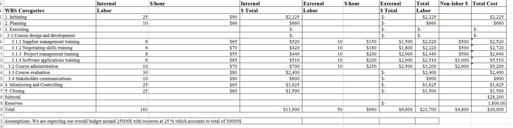

# Farm Shop

## Our Project
<strong>Project Title   :   </strong> Farm Shop 
   <strong>Project Tagline :   </strong>Shop From Anywhere 
   <strong>Team Name       :   </strong>Farmstead Avengers 
   <strong>Logo            :  
    &nbsp;&nbsp;&nbsp;&nbsp;&nbsp;&nbsp;&nbsp;&nbsp; &nbsp;&nbsp;&nbsp;&nbsp;     </strong> 
   

    
## Our Team

 &nbsp;&nbsp;  &nbsp; 
              

  [Mahitha Avula](https://github.com/MahithaAvula25) &nbsp;&nbsp;&nbsp;&nbsp;&nbsp;&nbsp;&nbsp;[SriVyshnaviKshatriya](https://github.com/SriVyshnaviKshatriya)             &nbsp;&nbsp;&nbsp;&nbsp;     

 
## Participants
|     Team Member          | Role              | 
 -------------             | :-------------:   |
| Mahitha Avula            | Project Manager   | 
| Sri Vyshnavi Kshatriya   | Full stack developer    | 

## Project Charter

This is the project charter for the Farm shop project. The objective of this undertaking is to develop and deliver a web-based application for Farm shop.
It includes the  information about success criteria,Approach,Team members etc
 
For detailed Information: [click here](https://github.com/MahithaAvula25/ProjectBoard058B/blob/main/project%20charter.md)

## Budget
* Project budget helps in estimate the total cost of a project that are likely to be incurred before the project is completed.
* It helps the stakeholders to know how much money is needed and when it is needed to complete the project.

To view the detail budget  [Click Here](https://github.com/MahithaAvula25/ProjectBoard058B/tree/main/Budget)

 

Total Budget Required For This Project = $30,000
 

## Gantt Chart

A Gantt chart is a visual project management tool that illustrates the timeline of tasks and their dependencies. It provides a horizontal bar chart representation of project tasks, showing their start and end dates, durations, and overlaps. Gantt charts help project managers and team members visualize the project schedule, identify critical tasks, manage dependencies, allocate resources, and track progress. They enable efficient planning, scheduling, and monitoring of projects.

 

To view the detail Gantt details  [Click Here](https://github.com/MahithaAvula25/ProjectBoard058B/tree/main/WBS)

## WorkBreakdownStructure(WBS)

 A Work Breakdown Structure is a hierarchical decomposition of a project into smaller, more manageable work components. Each level of the WBS represents increasingly detailed components, from high-level phases to individual work packages. It provides a foundation for project planning, estimation, resource allocation, and project control.

To view the detail Gantt details  [Click Here](https://github.com/MahithaAvula25/ProjectBoard058B/tree/main/WBS)

## To View The Additional Details Related To Our Project.Please Do Refer The Following Links

IssueLog : [Click Here](https://github.com/MahithaAvula25/ProjectBoard058B/tree/main/Issuelog) 
RiskRegister : [Click Here](https://github.com/MahithaAvula25/ProjectBoard058B/tree/main/Risk)  
RiskStrategies : [Click Here](https://github.com/MahithaAvula25/ProjectBoard058B/blob/main/Risk/Riskstrategies.md)  
Stakeholder Management Strategy : [Click Here](https://github.com/MahithaAvula25/ProjectBoard058B/blob/main/Stakeholder/stakeholdermgt.md) 
Stakeholder Register : [Click Here](https://github.com/MahithaAvula25/ProjectBoard058B/blob/main/Stakeholder/stakeholderregister.md) 

## Reflection Document
To view the Reflection Document : [Click Here](https://github.com/MahithaAvula25/ProjectBoard058B/blob/main/Stakeholder/stakeholdermgt.md) 
## Summary
<li>The project  Farm Shop  is an online website application that they would sell the seeds, chemicals required for Farmer.</li>
<li>The customer would be able to login by creating the account and can view menu list and buy the required items by adding to the cart. </li>
<li>Once the customer selects required items they will be redirected to checkout page.</li>
<li>We will provide the customer to edit the items that he added to cart and once the user have final check. They will be redirected to payment page.</li>
<li>Customer can select the way of payment they are comfortable like we will be providing options like Credit/Debit card, Home Delivery and Pick up options.</li>
<li>Once the user confirm the payment he/she will be provided the tracking status for the item that they have purchased.</li>

## References

1.Project Charter
<li>https://www.projectmanager.com/templates/project-charter-template</li>
<li>https://clickup.com/blog/project-charter-template/ </li> 
2. WorkBreakDown Structure
<li>https://www.projectmanager.com/guides/work-breakdown-structure </li>
<li>https://www.smartsheet.com/free-work-breakdown-structure-templates</li>
 
3. RiskRegister

<li>https://www.smartsheet.com/risk-register-templates</li>
<li>https://www.projectmanager.com/templates/risk-tracking-template</li>
